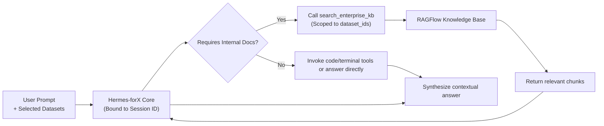

<p align="center">
  
</p>

# Hermes-forX ☤

<p align="center">
  <a href="https://github.com/xtcamille/hermes-forX"></a>
  <a href="https://github.com/xtcamille/hermes-forX/blob/main/LICENSE"></a>
  <a href="README.md"></a>
  <a href="README.zh-CN.md"></a>
</p>

**Hermes-forX** is an enterprise-grade, self-improving AI agent system built for real-world productivity. Deeply customized and enhanced from Nous Research's Hermes architecture, it preserves the industry-leading closed learning loop (autonomous skill synthesis, self-improving memory, and cross-session recall) and real terminal execution, while deeply integrating **New API centralized model authentication** and **RAGFlow enterprise knowledge base** with strict dataset session isolation.

---

## 🌟 Key Highlights & Architectural Enhancements

<table>
<tr>
  <td width="28%"><b>⚡ New API Unified Auth & Management</b></td>
  <td>
    Eliminates tedious manual API key configuration. Log in directly using your New API enterprise account (username/email + password); the agent automatically provisions, persists, and rotates <code>sk-xxxx</code> tokens and JWTs. Supports anonymous device fingerprint fast-trial and comes pre-configured with top-tier models (such as <code>qwen3.8-27b-5090</code>) out of the box.
  </td>
</tr>
<tr>
  <td><b>🏢 Enterprise Knowledge Base (RAGFlow)</b></td>
  <td>
    Deep integration with enterprise private RAG engines. Provides native model tools (<code>search_enterprise_kb</code> and <code>list_enterprise_kb</code>) that allow the agent to accurately retrieve internal enterprise documents, technical specifications, and knowledge chunks during conversation.
  </td>
</tr>
<tr>
  <td><b>🔒 Strict Dataset Session Isolation</b></td>
  <td>
    Implements bidirectional pairing between conversation session IDs and knowledge base datasets. Users can select and isolate datasets directly from the desktop/web <b>KB Picker Popover</b>, preventing unauthorized cross-dataset data leakage.
  </td>
</tr>
<tr>
  <td><b>🖥️ Multi-Surface Experience</b></td>
  <td>
    Offers a cross-platform <b>Electron Desktop App</b>, <b>Web Dashboard</b>, and <b>Terminal CLI (<code>forx</code>)</b>, featuring streamlined onboarding, interactive knowledge base selection, real-time token quotas, and one-click credential logout.
  </td>
</tr>
<tr>
  <td><b>🧠 Closed Learning Loop & Execution Core</b></td>
  <td>
    Inherits the full power of Hermes: autonomous skill creation after complex tasks, self-improving skill execution, persistent memories, multi-backend terminal runners (Local, Docker, SSH), subagent parallel delegation, and natural language Cron jobs.
  </td>
</tr>
</table>

---

## 🚀 Quickstart

### 1. Requirements

- **Python**: `>= 3.11, < 3.14`
- **uv**: Recommended package and environment manager ([Astral uv](https://docs.astral.sh/uv/))
- **Node.js & pnpm**: Required for building Desktop and Web apps (optional)

### 2. Local Setup & Installation

Clone the repository and install using `uv`:

```bash
git clone https://github.com/xtcamille/hermes-forX.git
cd hermes-forX

# Create and activate virtual environment
uv venv --python 3.11
source .venv/bin/activate       # Linux / macOS
# .venv\Scripts\activate       # Windows PowerShell

# Install project in editable mode with dependencies
uv pip install -e ".[all,dev]"
```

After installation, the CLI command `forx` (as well as `forx-agent` and `forx-acp`) will be available globally in the environment.

> **Config & Data Directory**: Configuration is stored in `~/.forx` (or `%LOCALAPPDATA%\forx` on Windows). You can override this location using the `FORX_HOME` environment variable.

---

## 🔑 Authentication & Knowledge Base Setup

### 1. New API Login

Authenticate with your New API gateway without manually dealing with API keys:

```bash
forx auth login
```

Enter your platform username/email and password. The system will automatically acquire your token, set up the inference endpoint, and configure the default model.

To log out and wipe cached credentials:

```bash
forx auth logout
```

### 2. Enterprise Knowledge Base Configuration

Hermes-forX comes with official account auto-login and session pairing out of the box. To customize or point to your own RAGFlow instance, update `~/.forx/config.yaml` or set environment variables:

```yaml
# ~/.forx/config.yaml
enterprise_kb:
  enabled: true
  base_url: "http://your-ragflow-server"
  official_account:
    username: "your-account@corp.com"
    password: "your-password"
```

Useful environment variables:
- `RAGFLOW_DEFAULT_URL`: Custom RAGFlow gateway URL
- `FORX_HOME`: Path override for the forX data/config directory (takes precedence over `HERMES_HOME`)

---

## 💻 Usage Modes

### Interactive CLI

```bash
forx                  # Start interactive TUI terminal chat
forx model            # Switch models or check provider status
forx tools            # Toggle enabled tools (enterprise_kb, terminal, etc.)
```

### Desktop Application (Electron)

Hermes-forX features a native desktop app:

```bash
cd apps/desktop
pnpm install
pnpm dev
```

Key Desktop features:
- **KB Picker**: Directly select active knowledge base datasets in the composer toolbar before sending prompts.
- **Native Login Modal**: Conveniently manage New API credentials, token quotas, and active sessions.
- **Side-by-side Previews**: Inspect Markdown, HTML, source code, and tool execution outputs in real time.

### Messaging Gateway

Connect your agent to messaging platforms (Telegram, Discord, Slack, etc.):

```bash
forx gateway setup    # Configure platform credentials
forx gateway start    # Start the daemon
```

---

## 📋 CLI Reference

| Command | Description |
| :--- | :--- |
| `forx` | Start interactive CLI session |
| `forx auth login` | Authenticate with New API and provision tokens |
| `forx auth logout` | Log out and revoke/clear local credentials |
| `forx model` | Select inference model and provider |
| `forx tools` | Configure toolsets and enterprise knowledge base access |
| `forx desktop` | Build and run the desktop application |
| `forx gateway` | Manage messaging gateway platforms |
| `forx doctor` | Run health checks and diagnose environment configuration |

---

## 🧩 Retrieval & Dataset Isolation Flow



---

## 🤝 Contributing & Testing

Contributions and feedback are welcome! Run test suites before submitting PRs:

```bash
# Run unit and integration tests for auth and enterprise KB
pytest tests/hermes_cli/test_auth_ragflow.py tests/tools/test_enterprise_kb_tool.py
```

---

## 📄 License

This project is licensed under the [MIT License](LICENSE). Built upon the pioneering agent architecture by [Nous Research](https://nousresearch.com), with enterprise customizations maintained by [CamilleZxt](https://github.com/xtcamille).
