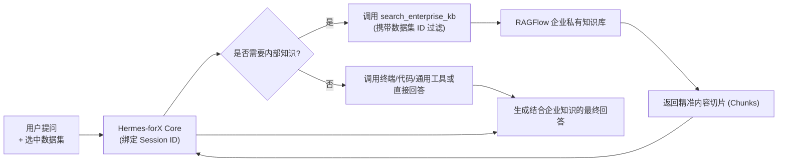

<p align="center">
  
</p>

# Hermes-forX ☤

<p align="center">
  <a href="https://github.com/xtcamille/hermes-forX"></a>
  <a href="https://github.com/xtcamille/hermes-forX/blob/main/LICENSE"></a>
  <a href="README.md"></a>
  <a href="README.zh-CN.md"></a>
</p>

**Hermes-forX** 是一套面向生产力场景的**企业级自进化 AI 智能体系统**。它基于 Nous Research 的 Hermes 架构深度研发与增强，不仅保留了强大的闭环学习能力（自主提炼技能、自演化记忆、跨会话回溯）与全终端环境执行能力，更深度融入了 **New API 统一模型网关认证** 与 **RAGFlow 企业私有知识库系统**，支持会话级知识库配对与严格的数据集隔离机制，提供 CLI、Electron 桌面端、Web 控制台与多平台网关的一致体验。

---

## 🌟 核心特性与架构升级

<table>
<tr>
  <td width="28%"><b>⚡ New API 统一认证与管理</b></td>
  <td>
    告别繁琐的手动配置 API Key。支持企业 New API 统一账号（用户名/邮箱 + 密码）原生一键登录，系统自动申请、持久化并轮换 <code>sk-xxxx</code> Token 与 JWT。支持匿名设备指纹快速试用，默认精选配置主力模型（如 <code>qwen3.8-27b-5090</code>），开箱即用。
  </td>
</tr>
<tr>
  <td><b>🏢 企业知识库 (RAGFlow 集成)</b></td>
  <td>
    深度集成企业私有 RAG 引擎，内置 <code>search_enterprise_kb</code> 与 <code>list_enterprise_kb</code> 专属模型工具，支持大模型在对话中自主精准检索企业内部文档、规范与技术知识。
  </td>
</tr>
<tr>
  <td><b>🔒 严格的数据集会话隔离</b></td>
  <td>
    实现会话 ID 与知识库检索绑定的双向配对机制。用户可在桌面端与 Web 端对话框的 <b>KB Picker Popover</b> 中按需勾选或切换授权数据集，确保检索范围严格隔离，绝不越权串访。
  </td>
</tr>
<tr>
  <td><b>🖥️ 全端协同沉浸式体验</b></td>
  <td>
    提供现代化的 <b>Electron 桌面应用</b>、<b>Web 交互控制台</b> 与 <b>全功能终端命令行 (CLI)</b>，配备极简 Onboarding 引导、知识库选择器、登录状态管理与一键注销清理。
  </td>
</tr>
<tr>
  <td><b>🧠 自闭环进化的智能体内核</b></td>
  <td>
    保留 Hermes 核心的技能闭环系统：复杂任务完成后自动提炼技能，在使用中自我改进；持久化 Agent 记忆；支持终端多后端执行（本地、Docker、SSH 等）、子代理并行协作与自然语言 Cron 定时自动化任务。
  </td>
</tr>
</table>

---

## 🚀 快速上手

### 1. 环境准备

- **Python**: `>= 3.11, < 3.14`
- **uv**: 推荐使用 [uv](https://docs.astral.sh/uv/) 作为包管理与虚拟环境工具
- **Node.js & pnpm**: 用于桌面端与 Web 控制台开发（可选）

### 2. 本地开发与安装

克隆仓库并使用 `uv` 安装项目依赖：

```bash
git clone https://github.com/xtcamille/hermes-forX.git
cd hermes-forX

# 创建并激活虚拟环境
uv venv --python 3.11
source .venv/bin/activate       # Linux / macOS
# .venv\Scripts\activate       # Windows PowerShell

# 安装项目（包含全部核心依赖与开发工具）
uv pip install -e ".[all,dev]"
```

安装完成后，系统将提供全局命令行工具 `forx`（及 `forx-agent`、`forx-acp`）。

> **数据与配置路径**：Hermes-forX 默认配置存储于 `~/.forx`（Windows 上位于 `%LOCALAPPDATA%\forx`）。可通过环境变量 `FORX_HOME` 自定义存储路径。

---

## 🔑 认证与知识库配置

### 1. 登录 New API 模型服务

使用统一认证系统，无需手动申请和配置各厂商的 API Key：

```bash
forx auth login
```

根据提示输入你的 New API 平台用户名（或邮箱）及密码，系统将自动完成鉴权、获取 Token 并配置默认模型。如需退出登录并清理凭证，可执行：

```bash
forx auth logout
```

### 2. 企业知识库 (RAGFlow) 配置

Hermes-forX 默认已内置官方企业知识库自动登录与会话挂载机制。如需连接自建或指定的 RAGFlow 服务，可在 `~/.forx/config.yaml` 或通过环境变量进行配置：

```yaml
# ~/.forx/config.yaml
enterprise_kb:
  enabled: true
  base_url: "http://your-ragflow-server"
  official_account:
    username: "your-account@corp.com"
    password: "your-password"
```

相关环境变量（可选）：
- `RAGFLOW_DEFAULT_URL`: 知识库服务网关地址
- `FORX_HOME`: 自定义 ForX 配置与工作区目录（优先于 `HERMES_HOME`）

---

## 💻 启动与使用模式

### 终端交互式会话 (CLI)

```bash
forx                  # 启动全功能终端 TUI 对话
forx model            # 查看与切换模型
forx tools            # 管理启用工具（如 enterprise_kb、terminal 等）
```

在终端对话中，智能体会根据你的提问意图，自动调用 `search_enterprise_kb` 检索内部知识库，或调用本地终端工具协助完成代码与运维任务。

### 桌面客户端 (Desktop Electron)

Hermes-forX 提供了开箱即用的跨平台桌面应用：

```bash
# 启动桌面端开发模式
cd apps/desktop
pnpm install
pnpm dev
```

桌面端特性：
- **知识库快捷选择器 (KB Picker)**：在输入框右下方直接点击知识库图标，实时查看已授权的数据集并一键勾选生效；
- **免密/极简登录**：内置原生登录对话框，支持实时查看 Token 额度与状态；
- **侧边栏预览**：代码文件、Markdown 报告、终端执行输出同屏渲染。

### 消息网关 (Messaging Gateway)

Hermes-forX 支持将智能体连接至即时通讯平台（Telegram、Discord、Slack 等）：

```bash
forx gateway setup    # 配置消息平台适配器
forx gateway start    # 启动后台网关守护进程
```

---

## 📋 常用命令速查

| 命令 | 说明 |
| :--- | :--- |
| `forx` | 启动交互式终端对话界面 |
| `forx auth login` | 登录 New API 平台账号并自动分配模型凭证 |
| `forx auth logout` | 注销当前用户身份并清理本地敏感 Token |
| `forx model` | 交互式切换推理模型及查看当前供应商状态 |
| `forx tools` | 查看与配置各类工具开关（企业知识库、文件、终端等） |
| `forx desktop` | 构建并启动桌面端应用 |
| `forx gateway` | 管理外部通讯平台网关（Telegram、Discord 等） |
| `forx doctor` | 一键诊断本地环境、网络连通性与配置项健康度 |

---

## 🧩 工具调用与数据集隔离机制

在对话生命周期中，知识库检索流程如下：



- **安全边界**：每次检索严格受限于当前会话激活的 `dataset_ids`，跨会话不会产生权限污染与数据串流；
- **全自动降级与恢复**：当网络波动或未指定数据集时，智能体将优雅给出友好提示并支持自主查询可用知识库列表 (`list_enterprise_kb`)。

---

## 🤝 贡献与测试

我们欢迎各类改进与反馈！在提交代码前，请确保运行测试套件：

```bash
# 执行单元测试与知识库集成测试
pytest tests/hermes_cli/test_auth_ragflow.py tests/tools/test_enterprise_kb_tool.py
```

---

## 📄 开源许可证

本项目基于 [MIT License](LICENSE) 开源发布。核心架构由 [Nous Research](https://nousresearch.com) 开创，企业级定制与增强功能由 [CamilleZxt](https://github.com/xtcamille) 持续维护与演进。
